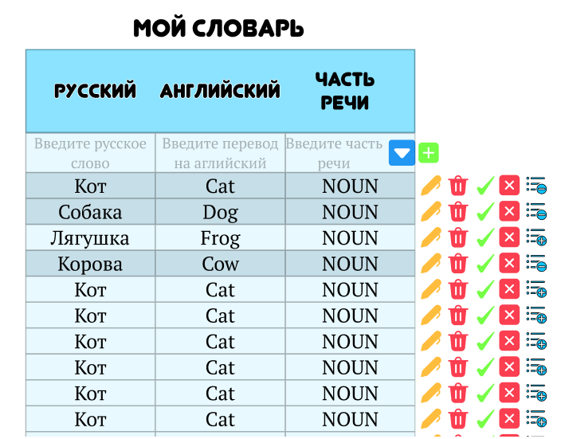

# Vocabulary Trainer

> 💬 Все комментарии будут заданы с данной пометкой для удобства проверки преподавателем(будут удалены перед защитой)

Vocabulary Trainer — это учебное backend-приложение для изучения иностранных слов.
Пользователь может добавлять слова в личный словарь и тренироваться с помощью тестов.
> 💬 В рамках проекта будет реализованы только CRUDS для объекта слово(Так как не вижу смысла пилить логику тестирования)

## Визуальная схема фронтенда

> 💬 Полный дизайн я пару лет назад делал тут(сам, ручками):  
> https://www.figma.com/design/wY7XfdGYXmF30YMbKtWVks/Goose-English?node-id=0-1&p=f&t=E9AcQvAnQIrJXGjr-0  - дизайн  
> https://www.figma.com/proto/wY7XfdGYXmF30YMbKtWVks/Goose-English?node-id=1-2&starting-point-node-id=1%3A2 - сразу прототип. Можете пощелкать. Там даже гусь двигается

## Документация
1. Маркетинг и аналитика  
i. [Маркетинг](docs/marketing.md) (💬 сделано нейронкой)  
ii.[Бизнес-документация](docs/business.md) (💬 сделано нейронкой)
2. Архитектура  
i. [ADR](docs/adr.md) (💬 сделано нейронкой)  
ii. [Описание API](docs/api.md)  (💬 сделано нейронкой)  
iii. [Архитектурные схемы](docs/arch-scheme.md) (💬 чуть переделал только первый слайд, остальное у Вас свистнул)  

## Структура проекта  
1. Модуль 1: Введение в Kotlin  
[m1l1-first](./lesson) - Вводное занятие, создание первой программы на Kotlin  
2. Модуль 2: Учебный проект  
[test-module](./vocabulary-be/test-module) - Тестовый модуль в качестве дз (💬 будет удален)

## Плагины Gradle сборки проекта  
[build-plugin](./build-plugin) Модуль с плагинами  
[BuildPluginJvm](./build-plugin/src/main/kotlin/BuildPluginJvm.kt) Плагин для сборки проектов JVM  
[BuildPluginMultiplarform](./build-plugin/src/main/kotlin/BuildPluginMultiplatform.kt) Плагин для сборки мультиплатформенных проектов

## Проектные модули

## Мониторинг и логирование

1. [deploy](./deploy) - Инструменты мониторинга и деплоя
2. [vocabulary-lib-logging-common](vocabulary-libs/vocabulary-lib-logging-common) - Общие объявления для
   логирования
3. [vocabulary-lib-logging-kermit](vocabulary-libs/vocabulary-lib-logging-kermit) - Библиотека логирования
   на базе библиотеки
   Kermit
4. [vocabulary-lib-logging-logback](vocabulary-libs/vocabulary-lib-logging-logback) - Библиотека логирования
   на базе библиотеки Logback
5. [vocabulary-lib-logging-socket](vocabulary-libs/vocabulary-lib-logging-socket) - Библиотека логирования
   на базе TCP-сокетов

### Транспортные модели, API

1. [specs](specs) - описание API в форме OpenAPI-спецификаций
2. [vocabulary-api-v1-jackson](vocabulary-be/vocabulary-api-v1-jackson) - Генерация первой версии
   транспортных модеелй с Jackson
3. [vocabulary-api-v1-mappers](vocabulary-be/vocabulary-api-v1-mappers) - Мапперы из API v1 во внутренние
   модели
4. [vocabulary-api-v1-kmp](vocabulary-be/vocabulary-api-v1-kmp) - Генерация первой версии транспортных
   моделей с KMP
5. [vocabulary-common](vocabulary-be/vocabulary-common) - модуль с общими классами для модулей проекта. В
   частности, там располагаются внутренние модели и контекст.
6. [vocabulary-mappers-log1](vocabulary-be/vocabulary-api-log1) - Мапер между внутренними моделями и
   моделями логирования первой версии

### Фреймворки и транспорты

1[vocabulary-app-ktor](vocabulary-be/vocabulary-app-ktor) - Приложение на Ktor

### Модули бизнес-логики

1. [vocabulary-stubs](vocabulary-be/vocabulary-stubs) - Стабы для ответов сервиса
2. [vocabulary-biz](vocabulary-be/vocabulary-biz) - Модуль бизнес-логики приложения: обслуживание стабов,
   валидация, работа с БД

## Библиотеки

### Мониторинг и логирование

1. [deploy](deploy) - Инструменты мониторинга и деплоя
2. [vocabulary-lib-logging-common](vocabulary-libs/vocabulary-lib-logging-common) - Общие объявления для
   логирования
3. [vocabulary-lib-logging-logback](vocabulary-libs/vocabulary-lib-logging-logback) - Библиотека логирования
   на базе библиотеки Logback
4. [vocabulary-lib-logging-socket](vocabulary-libs/vocabulary-lib-logging-socket) - Библиотека логирования
   на базе библиотеки Ktor и протокола TCP socket

## Тестирование

### Сквозные/интеграционные тесты

1. [vocabulary-e2e-be](vocabulary-tests/vocabulary-e2e-be) - Сквозные/интеграционные тесты для бэкенда
   системы